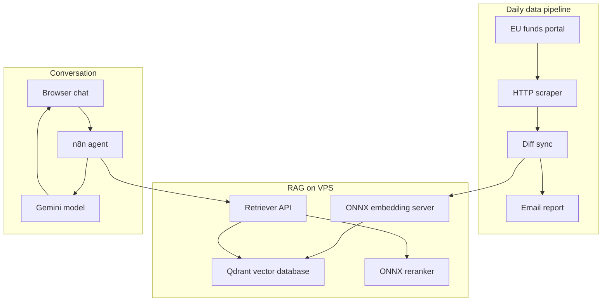

<p align="center"></p>

<h1 align="center">EU Funds Chatbot</h1>

<h3 align="center">A chatbot that answers questions about EU grants in Poland and returns only currently open calls. The announcement database refreshes daily.</h3>

<p align="center">
  
  
  
  
  
  
</p>

---

## Table of Contents

- [About](#about)
- [Screenshots](#screenshots)
- [Source Code](#source-code)
- [Stack](#stack)
- [Features](#features)
- [Architecture](#architecture)
- [Statistics](#statistics)
- [My Role](#my-role)
- [Contact](#contact)

---

## About

Poland's official EU funds portal publishes hundreds of calls at once. An entrepreneur looking for funding has to dig through lists of announcements, check eligibility criteria and deadlines. Some calls target a different region or a different type of applicant, and expired announcements still look current.

The chatbot replaces the search engine with a conversation. It first asks about the region, the applicant's status, and the goal, then returns matching calls with amounts, deadlines, and links. Answers are built only from documents in the database, not from the language model's memory. The database refreshes automatically every day: new announcements come in, removed ones drop out.

I built the system from scratch in six weeks (August-September 2025): the scraper, the vector index, retrieval, conversation orchestration, and the interface. Embeddings and reranking run locally on my own server, so the only per-query cost is the language model call.

---

## Screenshots

| First screen: four example questions | The chatbot asks about region, status, and goal |
|:---:|:---:|
|  |  |

| After the answer, the chatbot searches the live database | Result: matching calls with amounts and deadlines |
|:---:|:---:|
|  |  |

> **Note:** the frames are interface mockups with fictional calls. The chat layout matches the production UI 1:1. Real announcements are not published here.

---

## Source Code

The code is private. This repository documents the project: description, architecture, and working screenshots.

---

## Stack

### Interface

```
Next.js 15 (static export)   // single chat screen
React + Tailwind + shadcn/ui // chat bubbles, Markdown, animations
Netlify                      // hosting behind a custom domain
```

### Conversation Orchestration

```
n8n (self-hosted, Docker)    // AI agent with a RAG tool
Gemini 2.5 Pro               // answer generation
```

### Retrieval (local on VPS)

```
FastAPI + ONNX               // embedding server (e5-large) and reranker (polish-roberta, INT8)
Qdrant                       // 1024-dim collection, Cosine
Fastify                      // POST /retrieve: 10 candidates, rerank, top 3
```

### Data Pipeline

```
Node.js + Cheerio + Turndown // daily scraping of the EU funds portal
SHA-256 dedup                // the same document never lands twice
cron + mutt                  // sync at 3:00 AM, email report
```

---

## Features

- **Conversation instead of a search engine** - the chatbot asks about region, status, and goal, then returns calls matched to the situation. The user does not need to know program names or understand the funds' structure
- **Only current announcements** - the calls database refreshes automatically every day. An announcement that disappeared from the portal also drops out of the answers
- **Answers from documents, not from model memory** - the language model receives the full text of matching announcements and answers only from them. This limits invented programs and amounts
- **Two-stage hit selection** - out of ten candidates, the system picks the three most relevant documents. The answer builds on the best matches, not the first available result
- **Report after every sync** - after the nightly import, the operator gets an email summary: how many announcements came in, how many dropped out. The database does not die silently
- **No login, no installation** - the chat runs in the browser, without an account

---

## Architecture



---

## Statistics

### Technical Complexity

| Metric | Value |
|---|---|
| **Build window** | 6 weeks (August-September 2025) |
| **Lines of code** | 2,112 (22 source files) |
| **Layers** | 4 (scraper, index, retrieval, chat) |
| **Local ONNX models** | 2 (embedding + reranker) |
| **Vector dimension** | 1024 (Cosine) |
| **Hit selection** | 10 candidates, rerank, 3 documents |
| **Sync** | daily at 3:00 AM + email report |
| **Per-query cost** | only the LLM call (everything else self-hosted) |

### Feature Overview

| Category | Highlights |
|---|---|
| **Conversation** | follow-up questions about region, status, and goal |
| **Data** | daily scraping, dedup, diff against the database |
| **Answer quality** | RAG on full documents, reranking |
| **Ops** | auto-start after reboot, email reports |

---

## My Role

All the code is mine: the scraper, the vector index, retrieval, the n8n orchestration, and the chat interface. The product concept was developed together with [Wojtek](https://github.com/wandrysiak) and his brother.

---

## Contact

| Platform | Link |
|---|---|
| **WWW** | [kamilkaczmareksolutions.com](https://kamilkaczmareksolutions.com) |
| **GitHub** | [kamilkaczmareksolutions](https://github.com/kamilkaczmareksolutions) |
| **LinkedIn** | [Kamil Kaczmarek](https://www.linkedin.com/in/kamilkaczmareksolutions) |
| **Email** | [recruitment@kamilkaczmareksolutions.com](mailto:recruitment@kamilkaczmareksolutions.com) |

---

**EU Funds Chatbot** - you ask in Polish, you get currently open calls.

<p align="center"><em>Built by Kamil Kaczmarek</em></p>
