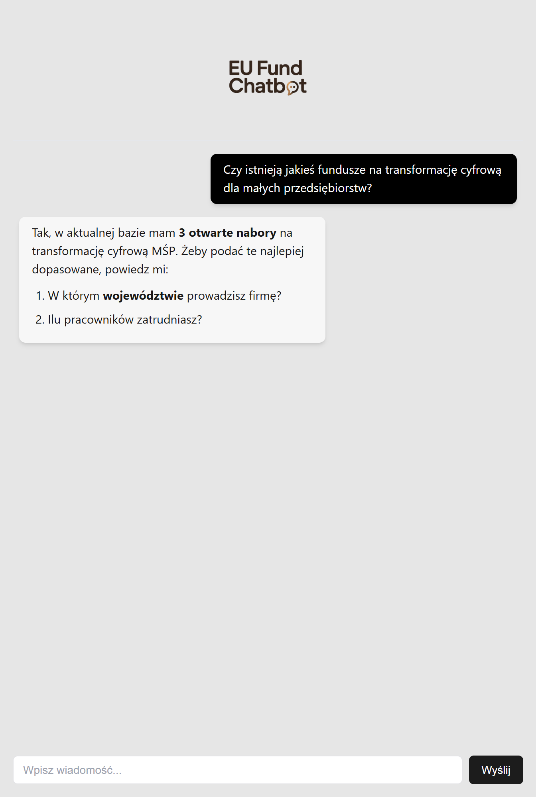
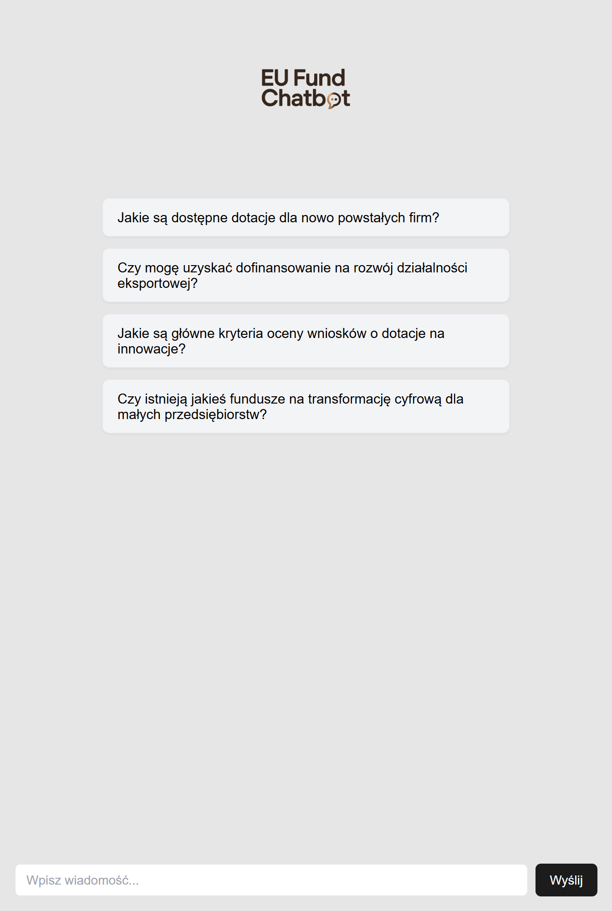
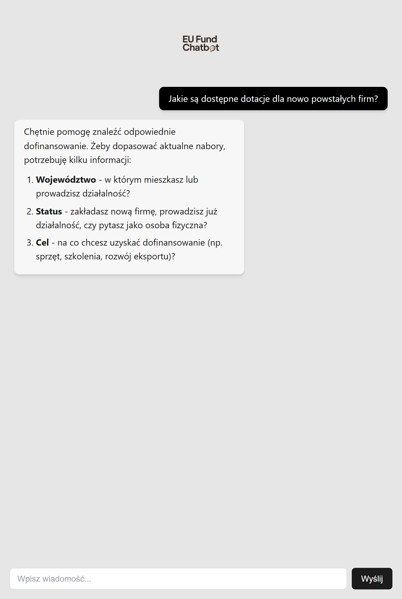
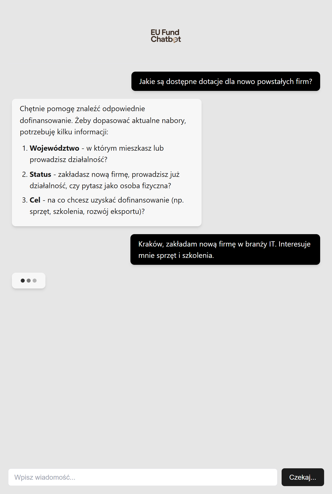
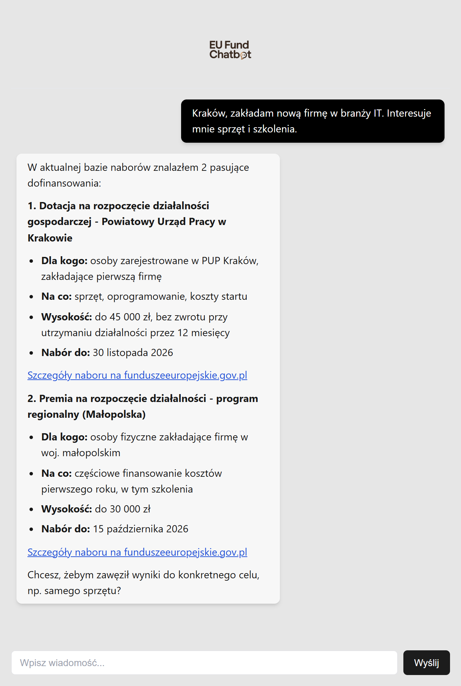
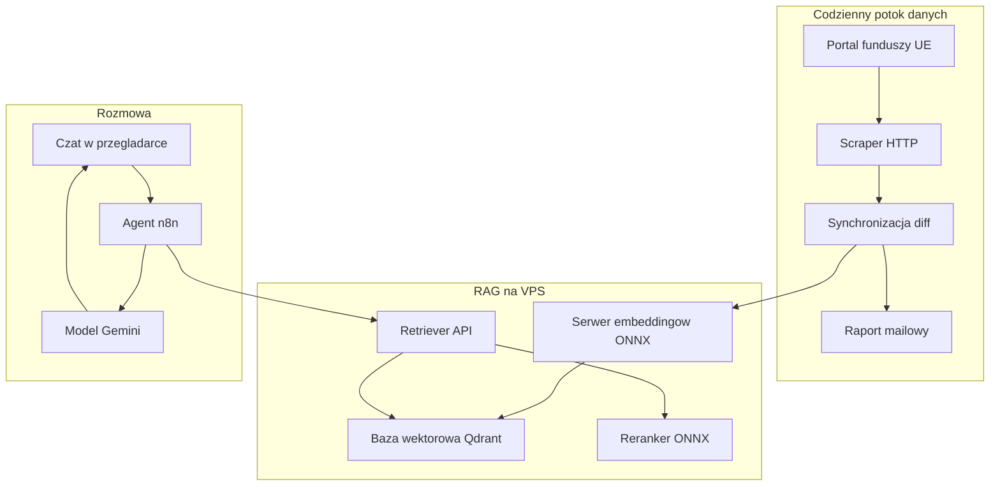

<p align="center"></p>

<h1 align="center">Chatbot Funduszy Europejskich</h1>

<h3 align="center">Chatbot, który odpowiada na pytania o dotacje unijne i podaje tylko aktualne nabory. Baza ogłoszeń odświeża się codziennie.</h3>

<p align="center">
  
  
  
  
  
  
</p>

---

## Spis treści

- [O projekcie](#o-projekcie)
- [Screenshoty](#screenshoty)
- [Kod źródłowy](#kod-źródłowy)
- [Stack](#stack)
- [Funkcje](#funkcje)
- [Architektura](#architektura)
- [Statystyki](#statystyki)
- [Moja rola](#moja-rola)
- [Kontakt](#kontakt)

---

## O projekcie

Oficjalny portal funduszy europejskich publikuje setki naborów naraz. Przedsiębiorca, który szuka dofinansowania, musi przekopywać listy ogłoszeń, sprawdzać kryteria i terminy. Część naborów dotyczy innego regionu albo innego typu podmiotu, a przeterminowane ogłoszenia dalej wyglądają na aktualne.

Chatbot zamienia wyszukiwarkę na rozmowę. Najpierw pyta o województwo, status i cel, potem podaje pasujące nabory z kwotami, terminami i linkami. Odpowiedzi powstają wyłącznie z dokumentów w bazie, a nie z pamięci modelu językowego. Baza odświeża się codziennie automatycznie: nowe ogłoszenia wchodzą, zniknięte wypadają.

System zbudowałem od zera w sześć tygodni (sierpień-wrzesień 2025): scraper, indeks wektorowy, retrieval, orkiestrację rozmowy i interfejs. Embeddingi i reranking liczą się lokalnie na własnym serwerze, więc jedyny koszt zapytania to wywołanie modelu językowego.

---

## Screenshoty

| Pierwszy ekran: cztery przykładowe pytania | Chatbot dopytuje o region, status i cel |
|:---:|:---:|
|  |  |

| Po odpowiedzi chatbot przeszukuje aktualną bazę | Wynik: dopasowane nabory z kwotami i terminami |
|:---:|:---:|
|  |  |

> **Nota:** kadry to makiety interfejsu z fikcyjnymi naborami. Układ czatu odpowiada 1:1 produkcyjnemu UI. Prawdziwe ogłoszenia nie są publikowane.

---

## Kod źródłowy

Kod jest prywatny. To repo dokumentuje projekt: opis, architekturę i zrzuty działania.

---

## Stack

### Interfejs

```
Next.js 15 (static export)   // jeden ekran czatu
React + Tailwind + shadcn/ui // dymki rozmowy, Markdown, animacje
Netlify                      // hosting pod własną domeną
```

### Orkiestracja rozmowy

```
n8n (self-host, Docker)      // agent AI z narzędziem RAG
Gemini 2.5 Pro               // generacja odpowiedzi
```

### Retrieval (lokalnie na VPS)

```
FastAPI + ONNX               // serwer embeddingów (e5-large) i reranker (polish-roberta, INT8)
Qdrant                       // kolekcja 1024-wymiarowa, Cosine
Fastify                      // POST /retrieve: 10 kandydatów, rerank, top 3
```

### Potok danych

```
Node.js + Cheerio + Turndown // codzienny scraping portalu funduszy
dedup SHA-256                // ten sam dokument nie ląduje dwa razy
cron + mutt                  // synchronizacja o 3:00, raport mailowy
```

---

## Funkcje

- **Rozmowa zamiast wyszukiwarki** - chatbot sam dopytuje o region, status i cel, potem podaje nabory dopasowane do sytuacji. Użytkownik nie musi znać nazw programów ani rozumieć struktury funduszy
- **Tylko aktualne ogłoszenia** - baza naborów odświeża się codziennie automatycznie. Ogłoszenie, które zniknęło z portalu, wypada też z odpowiedzi
- **Odpowiedzi z dokumentów, nie z pamięci modelu** - model językowy dostaje pełną treść pasujących ogłoszeń i odpowiada tylko na ich podstawie. To ogranicza zmyślone programy i kwoty
- **Dwustopniowa selekcja trafień** - z dziesięciu kandydatów system wybiera trzy najtrafniejsze dokumenty. Odpowiedź opiera się na najlepszych dopasowaniach, nie na pierwszym lepszym wyniku
- **Raport po każdej synchronizacji** - po nocnym imporcie operator dostaje maila z podsumowaniem: ile ogłoszeń doszło, ile zniknęło. Baza nie umiera po cichu
- **Bez logowania i instalacji** - czat działa w przeglądarce, bez konta

---

## Architektura



---

## Statystyki

### Złożoność techniczna

| Metryka | Wartość |
|---|---|
| **Okno prac** | 6 tygodni (sierpień-wrzesień 2025) |
| **Linie kodu** | 2 112 (22 pliki źródłowe) |
| **Warstwy** | 4 (scraper, indeks, retrieval, czat) |
| **Modele ONNX lokalnie** | 2 (embedding + reranker) |
| **Wymiar wektora** | 1024 (Cosine) |
| **Selekcja trafień** | 10 kandydatów, rerank, 3 dokumenty |
| **Synchronizacja** | codziennie o 3:00 + raport mailowy |
| **Koszt zapytania** | tylko wywołanie LLM (reszta self-host) |

### Przegląd funkcji

| Kategoria | Najważniejsze |
|---|---|
| **Rozmowa** | dopytania o region, status i cel |
| **Dane** | codzienny scraping, dedup, diff z bazą |
| **Jakość odpowiedzi** | RAG na pełnych dokumentach, rerank |
| **Ops** | auto-start po restarcie, raporty mailowe |

---

## Moja rola

Cały kod jest mój: scraper, indeks wektorowy, retrieval, orkiestracja w n8n i interfejs czatu. Koncepcję produktu wypracowałem wspólnie z [Wojtkiem](https://github.com/wandrysiak) i jego bratem.

---

## Kontakt

| Platforma | Link |
|---|---|
| **WWW** | [kamilkaczmareksolutions.com](https://kamilkaczmareksolutions.com) |
| **GitHub** | [kamilkaczmareksolutions](https://github.com/kamilkaczmareksolutions) |
| **LinkedIn** | [Kamil Kaczmarek](https://www.linkedin.com/in/kamilkaczmareksolutions) |
| **Email** | [recruitment@kamilkaczmareksolutions.com](mailto:recruitment@kamilkaczmareksolutions.com) |

---

**Chatbot Funduszy Europejskich** - pytasz po polsku, dostajesz aktualne nabory.

<p align="center"><em>Zbudował Kamil Kaczmarek</em></p>
